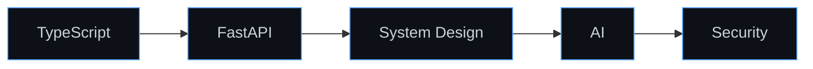

 

  

## About Me

I'm a Computer Science undergraduate at **Andhra University** with a backend-first mindset and a growing obsession with AI systems. I started out writing simple scripts to automate small annoyances, and somewhere between debugging a broken API at 2 AM and watching a model finally converge, I realized I wanted to spend my career at the intersection of **robust engineering** and **intelligent systems**.

I care less about chasing frameworks and more about understanding *why* something works — how a request travels through a server, how a database index actually saves milliseconds, how an agent decides its next action. That curiosity has pushed me through hackathons, quizzes, and a nomination for **Smart India Hackathon (SIH)**, and it's the same curiosity driving me toward becoming a full-stack engineer who can ship AI-native products end to end.

<b>A few things I believe in</b>

 

- Clean, boring code beats clever, fragile code.
- Understanding the problem is 80% of solving it.
- The best products are built at the intersection of good UX and solid systems.

## Current Focus

| | | |
|:---:|:---:|:---:|
| **TypeScript**   Typed, scalable JS | **FastAPI**   High-performance APIs | **Backend Engineering**   Systems that don't fall over |
| **AI Agents**   Autonomous workflows | **System Design**   Designing for scale | **Security**   Auth, hardening & safe defaults |

## Tech Stack

**Languages**
 

  

**Frontend**
 

  

**Backend**
 

  

**Databases**
 

  

**DevOps**
 

  

**Tools**
 

## GitHub Analytics

 

 

  

> **Note:** The snake animation above requires a one-time GitHub Actions workflow (`Platane/snk`) pushing to an `output` branch on this repo — set it up once and it updates automatically on every commit.

## Featured Projects

 

### 🔹 Cine-Mark — Movie Discovery & Watchlist Platform

**Stack:** `Node.js` `Express 5` `Prisma 6` `PostgreSQL` `JWT` `Google OAuth 2.0` `Python FastAPI` `React` `Next.js`

- Shipped a 14-endpoint REST API (4 auth, 2 movie, 8 watchlist) with modular separation across auth, movie, and watchlist domains — fully verified with a dedicated Postman/curl test suite covering every route and error case.
- Secured the API with dual JWT (access + refresh) tokens, Google OAuth 2.0, Helmet, CORS, rate limiting, and Zod validation; decoupled ML recommendations/chat into a standalone Python FastAPI microservice to isolate inference from the core event loop.

 

### 🔹 Notes-Flow — SaaS Workspace & Notes Platform

**Stack:** `Next.js 16` `React 19` `TypeScript` `Node.js` `Express` `MongoDB` `Mongoose` `JWT` `Redis` `Google OAuth 2.0`

- Built a ~25-endpoint Express/MongoDB API spanning auth, workspaces, notes, and a Kanban-style task board with status transitions — structured into a reusable controllers/models/routes/middleware pattern.
- Implemented dual-mode authentication (local bcrypt + Google OAuth 2.0) with access/refresh JWTs in HttpOnly cookies, and added Redis caching plus endpoint rate-limiting to cut repeat-query load and block abusive request patterns.

 

### 🔹 AI-Bridge — Distributed AI Gateway Microservice

**Stack:** `Node.js` `Express` `TypeScript` `Prisma` `PostgreSQL` `Python FastAPI`

- Engineered the central TypeScript/Express orchestration gateway for a 3-member distributed team, integrating Prisma/PostgreSQL to manage businesses, widgets, and live chat sessions across the platform.
- Designed asynchronous, worker-based request processing to proxy AI/ML inference to a Python/FastAPI service without blocking the main event loop, and built a secure gateway that fully proxies traffic between the frontend widget and the ML pipeline with zero API-key exposure to the client.

 

### 🔹 CSSE-SuperStudent

*Details coming soon — add a short description and tech stack here to match the format above.*

## Learning Roadmap

## Fun Facts

| | |
|:---|:---|
| 🥈 | Placed 2nd in the CSSE Technical Quiz at Andhra University |
| 🥉 | Placed 3rd in a Hackathon at CSSE, Andhra University |
| 🚀 | Nominated for Smart India Hackathon (SIH) |
| 🌙 | Most productive between 11 PM and 2 AM |
| ☕ | Believes good code and good coffee are non-negotiable |

## Let's Connect

  

*Always open to learning, collaboration, and exciting opportunities.*

