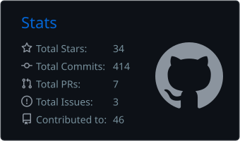
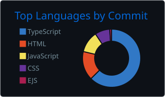

### **I build backend systems: REST APIs, authentication, caching, and async processing. Lately I've been integrating AI into products through agents, tool-based workflows, and streaming LLM responses.**

## Tech Stack

  

- **Languages:** JavaScript, TypeScript, Python, C, Java
- **Backend:** Node.js, Express.js, FastAPI, REST APIs, JWT, OAuth 2.0, Zod
- **Databases:** PostgreSQL, MongoDB, Redis, Prisma, Mongoose
- **AI / LLM:** AI Agents, Tool-Based Workflows, LLM Streaming, RAG
- **Frontend:** React.js, Next.js, HTML5, CSS3, Tailwind CSS
- **Tools:** Git, GitHub, Postman, Supabase, Vercel, Render
- **Concepts:** System Design, Microservices, Caching, Rate Limiting, Async Processing

## Projects

### AI-Bridge
Distributed AI gateway microservice, built with a 3-member team.  
`Node.js` `Express.js` `TypeScript` `Prisma` `PostgreSQL` `FastAPI`

- Engineered the central TypeScript/Express gateway that manages businesses, widgets, and chat sessions on Prisma/PostgreSQL.
- Designed async worker-based processing that proxies AI/ML inference to FastAPI without blocking the main event loop.
- Kept AI API keys server-side so no credentials reach the client.

[GitHub](https://github.com/ramcharankhv-byte/AI-BRIDGE) · [Live](https://aibridge-lilac.vercel.app/)

<!-- Optional: add a load-test number here, e.g. "sustained N concurrent chat sessions at p95 X ms" -->

### Cine-Mark
Movie discovery and watchlist platform.  
`Node.js` `Express.js` `Prisma` `PostgreSQL` `Redis` `Supabase` `JWT` `OAuth 2.0` `FastAPI` `Next.js`

- Designed a modular REST API across authentication, movie discovery, and watchlist domains, with validation, pagination, health checks, and API documentation.
- Integrated Supabase authentication, Prisma/PostgreSQL persistence, and the OMDB API for movie data.
- Added Redis caching, rate limiting, structured logging, and deployment workflows for production readiness.

[GitHub](https://github.com/ramcharankhv-byte/CINE-MARK) · [Live](https://cine-mark-eosin.vercel.app/)

<!-- Optional: add cache hit ratio or latency improvement, e.g. "cut median response time by X%" -->

### Notes-Flow
SaaS workspace for notes and a Kanban-style task board.  
`Next.js` `TypeScript` `Node.js` `Express.js` `MongoDB` `Redis` `JWT` `OAuth 2.0`

- Built a modular Express/MongoDB backend (controllers, models, routes) covering authentication, workspaces, notes, and a Kanban board with status transitions.
- Implemented local and Google OAuth 2.0 login with access/refresh JWTs stored in HttpOnly cookies.
- Added Redis caching, request validation, logging, and rate limiting to harden the API.

[GitHub](https://github.com/ramcharankhv-byte/NOTES-FLOW) · [Live](https://notes-flow-lake.vercel.app)

### CSSE SuperStudent
Attendance and student management app for AU's CSSE department.  
`Next.js` `TypeScript` `Tailwind CSS` `TensorFlow.js` `Supabase`

- Built a student management platform with face-recognition attendance using TensorFlow.js.
- Placed 🥉 3rd of 20 teams at the AuraX Hackathon.

[GitHub](https://github.com/ramcharankhv-byte/CSSE-SUPERSTUDENT) · [Live](https://csse-superstudent.vercel.app)

### AERO-VIEW
3D property mapping platform based on ULPIN.  
`Next.js` `TypeScript` `Cesium` `PostGIS` `Zustand` `Tailwind CSS`

- Modelled parcels, buildings, floors, units, and underground utilities in a 3D geospatial view using Cesium and PostGIS.
- Placed 🥉 3rd of 122 teams at the SIH Internal Hackathon.

[GitHub](https://github.com/ramcharankhv-byte/AERO-VIEW) · [Live](https://aero-view-theta.vercel.app/)

## Achievements

- 🥉 **SIH Internal Hackathon** · 3rd of 122 teams (AERO-VIEW)
- 🥉 **AuraX Hackathon** · 3rd of 20 teams (CSSE SuperStudent)
- 🥈 **AuraX Technical Quiz** · 2nd place
- 🎯 **AP EAMCET Rank 1718** · AUEET Rank 23

## GitHub Stats

  
  

  

